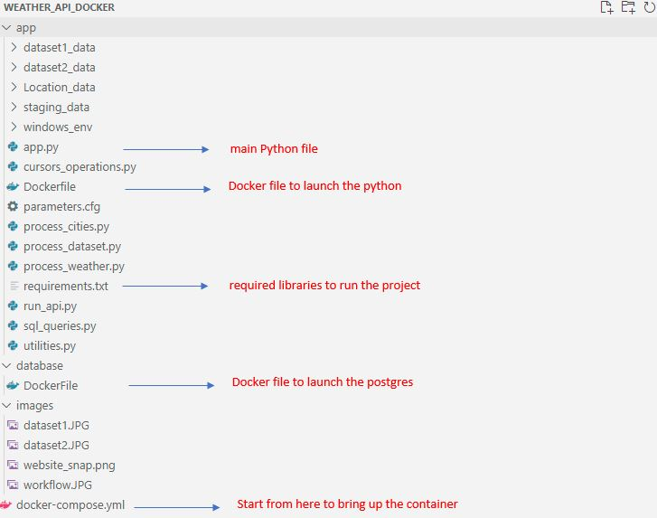
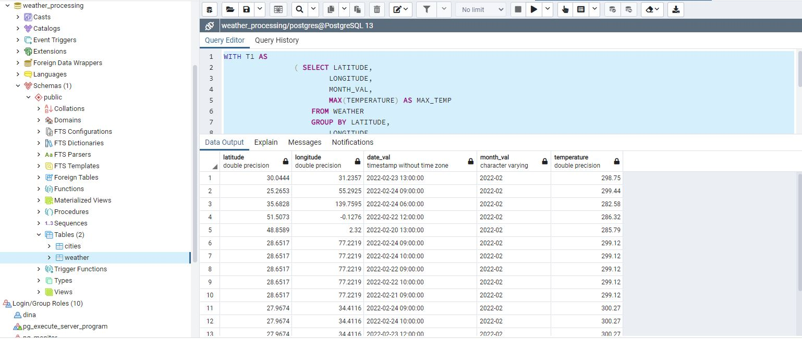
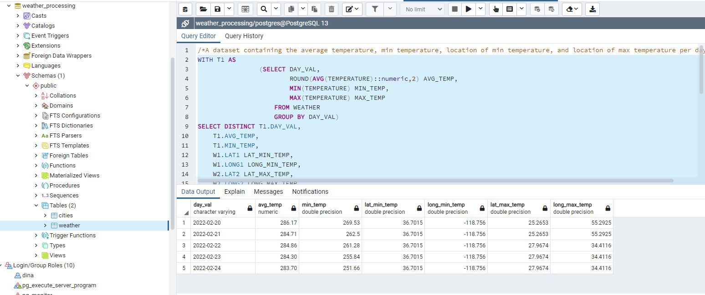

# Weather API processing

In this project, I will construct a Workflow to process the weather extracted data using API to query the data for different cities as well as provide analytical dataset as per the requirements.

The data source is from https://openweathermap.org/ 

# Project Architecture

I used Python to build my whole project and stored data using Postgres. My whole project was built on windows so anyone would like to use the docker image should still use windows otherwise reading the files/directories may not work

My work has been summarized as below:
1. First, I create account on Openweather, it tooks a while till my account got activated.
2. I found the API to query the 5 last days taking only co-ordinates. I wanted some conveniance so I created a module that taked the popular cities name and return the co-ordinates. For this I used geopy library. I save those values for later use when I run the API
3. I then constructed a list of timestamp so I loop over to query several days calls as the API can return only 1 day hourly data
4. Now my data is ready so I used them to construct the APIs and the response content got stored in the staging_data folder
5. I then process each JSON and store the information I found needed later in the database. I faced one issue that the timezone where not storing properly which would affect my calculation later so I have altered the whole DB time zone to be UTC
6. Last step is to construct the 2 required dataset, I developed the queries first and tested on the PgAdmin and then automate the run within the main program script.

The folder Structure:

# Project Output

2 Datasets were required as part of the project delivery

### Dataset 1

A dataset containing the location, date and temperature of the highest temperatures reported by location and month.
The dataset was executed as part of the main program and can be availble in the dataset1_data directory

### Dataset 2

A dataset containing the average temperature, min temperature, location of min temperature, and location of max temperature per day.
The dataset was executed as part of the main program and can be availble in the dataset2_data directory

